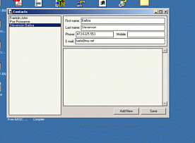



## Resizer with anchors \(a little like in \.NET\)

### Description

Just another simple resizer? No! There are many similar submissions, but this one is more convenient for developers - it uses anchoring mechanism based on the .NET concept.

This submission comes with some samples and a special Frame component, that supports anchoring.

Please leave your suggestions, comments and votes - if you like this code.
 
### More Info
 

             |
---                |---
**Submitted On**   |2003-11-04 10:29:14
**By**             |[Tomasz Puwalski](https://github.com/Planet-Source-Code/PSCIndex/blob/master/ByAuthor/tomasz-puwalski.md)
**Level**          |Intermediate
**User Rating**    |5.0 (75 globes from 15 users)
**Compatibility**  |VB 6\.0
**Category**       |[Miscellaneous](https://github.com/Planet-Source-Code/PSCIndex/blob/master/ByCategory/miscellaneous__1-1.md)
**World**          |[Visual Basic](https://github.com/Planet-Source-Code/PSCIndex/blob/master/ByWorld/visual-basic.md)
**Archive File**   |[Resizer\_wi169022142004\.zip](https://github.com/Planet-Source-Code/tomasz-puwalski-resizer-with-anchors-a-little-like-in-net__1-50708/archive/master.zip)

